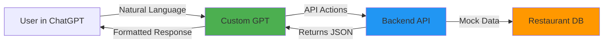
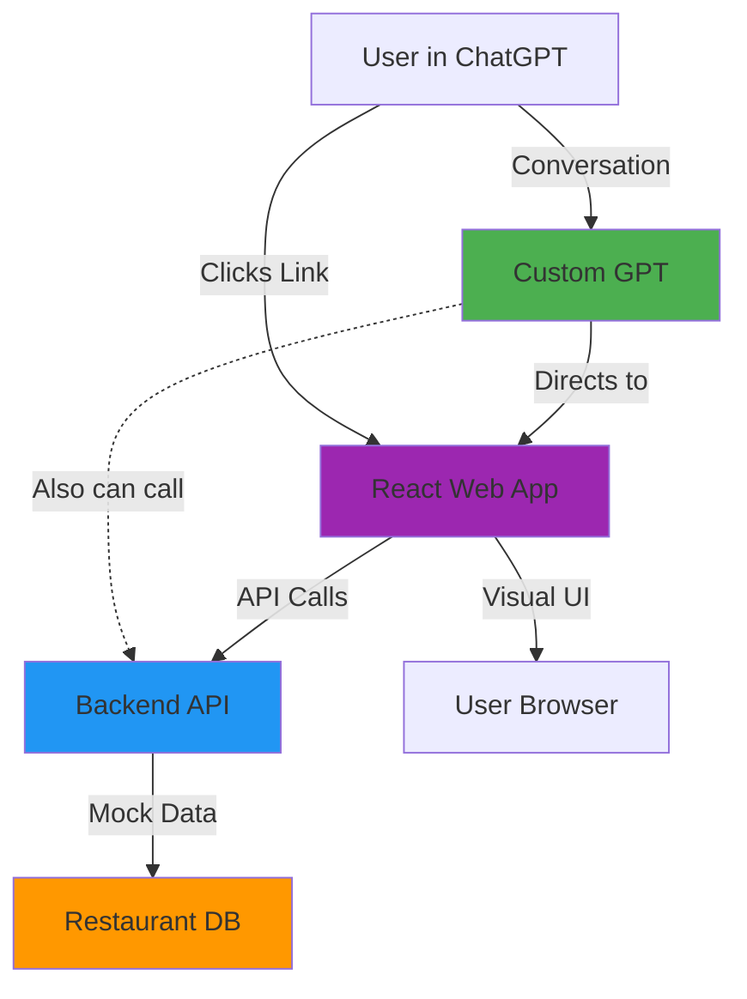
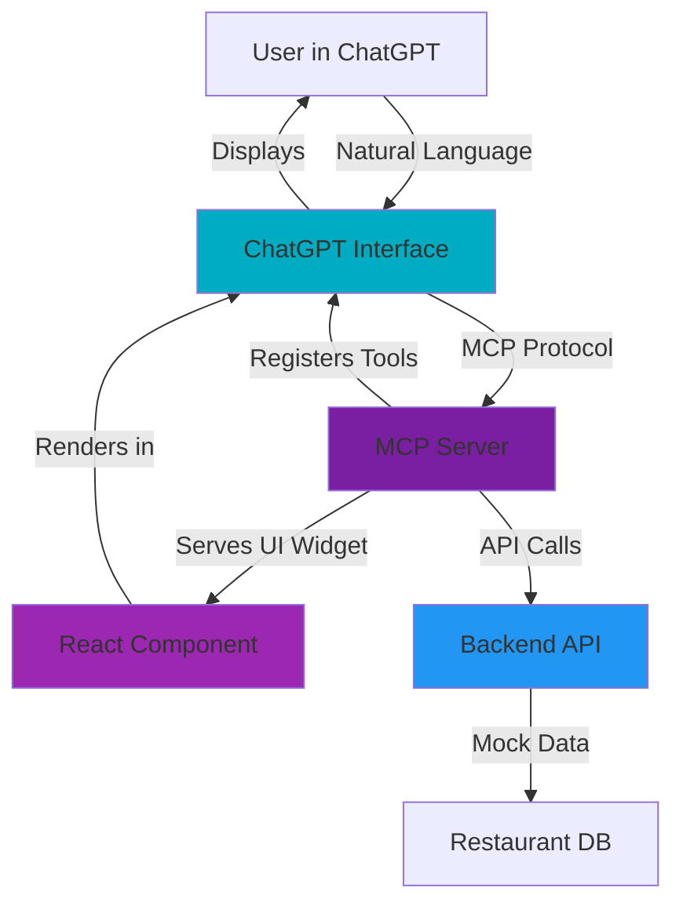
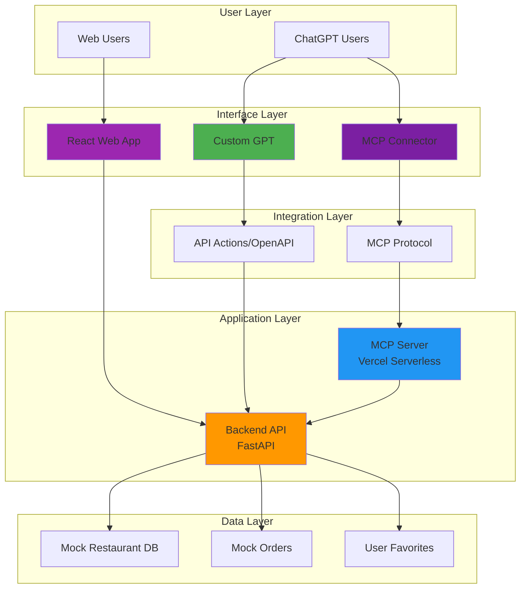

# 🍽️ AI-Powered Food Ordering System
## Complete Architecture & Deployment Strategy

---

## Slide 1: The Problem Statement

### 🎯 Current Food Ordering Challenges

**User Pain Points:**
- Multiple apps required (Uber Eats, DoorDash, Grubhub, etc.)
- Context switching between chat and ordering apps
- No conversational interface for ordering
- Repetitive form filling for every order
- Difficult to discover new restaurants

**Market Opportunity:**
- 70% of users already use ChatGPT daily
- Natural language is the most intuitive interface
- AI can provide personalized recommendations
- Conversational ordering reduces friction
- Integration with existing ChatGPT workflow

**Our Vision:**
> "Order food naturally through conversation, without leaving ChatGPT"

**Key Insight:**
Users don't want another app - they want to order food where they already are: **in ChatGPT**.

---

## Slide 2: Three Implementation Approaches

### 📊 Comparison Matrix

| Approach | User Experience | Setup Complexity | Availability | Interactive UI |
|----------|----------------|------------------|--------------|----------------|
| **Approach 1: Custom GPT** | Conversational only | Low | Anyone with link | ❌ No |
| **Approach 2: Custom GPT + Web App** | Hybrid (chat + visual) | Medium | Anyone with link | ✅ External |
| **Approach 3: MCP Connector** | Conversational + Interactive | Medium | Organization/Future Public | ✅ In ChatGPT |

### 🎯 Strategic Positioning

```
Simple ←─────────────────────────────────────→ Advanced
  │                    │                         │
Approach 1         Approach 2              Approach 3
Custom GPT      GPT + Web App           MCP Connector
(MVP)           (Enhanced)              (Future-Ready)
```

### Decision Framework

**Choose Approach 1 when:**
- Quick MVP needed
- Conversational interface sufficient
- No visual UI required
- Testing concept

**Choose Approach 2 when:**
- Need visual menu browsing
- Users want to see restaurant photos
- Hybrid experience desired
- Immediate deployment needed

**Choose Approach 3 when:**
- Best user experience required
- Interactive UI inside ChatGPT needed
- Organization has MCP access
- Future-proof solution desired

---

## Slide 3: Approach 1 - Custom GPT (MVP)

### 🏗️ Architecture



### 📝 Implementation Details

**Components:**
- **Custom GPT**: Conversational interface with instructions
- **API Actions**: OpenAPI schema defining 5 endpoints
- **Backend API**: FastAPI on Vercel (ai-food-ordering-poc)
- **Mock Data**: 16 restaurants across 5 cities

**API Endpoints:**
```
GET  /api/v1/cities              → List available cities
GET  /api/v1/cuisines            → List cuisine types
GET  /api/v1/restaurants/search  → Search restaurants
GET  /api/v1/restaurants/{id}/menu → Get menu
POST /api/v1/orders/create       → Place order
```

**User Flow:**
```
1. User: "I want to order food"
2. GPT calls getCities → Shows cities
3. User: "Bangalore"
4. GPT calls getCuisines → Shows cuisines
5. User: "Indian"
6. GPT calls searchRestaurants → Lists restaurants
7. User: "Show menu for Spice Garden"
8. GPT calls getMenu → Displays menu
9. User: "Butter Chicken and Garlic Naan"
10. GPT collects address, calls createOrder
11. Order confirmed with ID and delivery time
```

**Pros:**
- ✅ Fast to implement (1 day)
- ✅ Pure conversational interface
- ✅ No additional UI needed
- ✅ Works with existing ChatGPT
- ✅ Easy to test and iterate

**Cons:**
- ❌ No visual menu browsing
- ❌ Text-only descriptions
- ❌ Limited discoverability
- ❌ Requires manual GPT selection

**Status:** ✅ **LIVE & WORKING**

---

## Slide 4: Approach 2 - Custom GPT + Web App (Hybrid)

### 🏗️ Architecture



### 📝 Implementation Details

**Components:**
- **Custom GPT**: Guides users and provides link
- **React Web App**: Interactive visual interface (Vite + TypeScript)
- **Backend API**: Same FastAPI backend
- **Shared Data**: Both use same API endpoints

**Web App Features:**
```
City Selector     → Visual city cards with icons
Cuisine Selector  → Cuisine type buttons
Restaurant List   → Cards with photos, ratings, delivery time
Menu View         → Categorized items with images, prices
Shopping Cart     → Real-time cart management
Checkout          → Address form and order confirmation
```

**User Flow:**
```
Option A - Start in ChatGPT:
1. User: "I want to order food"
2. GPT: "Visit our interactive app: [link]"
3. User clicks link → Opens web app
4. Visual browsing and ordering

Option B - Direct to Web App:
1. User visits: https://ai-food-ordering-app-ten.vercel.app
2. Selects city → cuisine → restaurant → menu
3. Adds to cart → Checkout → Order placed
```

**Pros:**
- ✅ Visual menu browsing
- ✅ Restaurant photos and ratings
- ✅ Familiar e-commerce UI
- ✅ Works without ChatGPT Plus
- ✅ Can be used standalone

**Cons:**
- ❌ Leaves ChatGPT interface
- ❌ Context switching required
- ❌ Two separate experiences
- ❌ Not truly integrated

**Status:** ✅ **LIVE & WORKING**

**URLs:**
- Web App: `https://ai-food-ordering-app-ten.vercel.app`
- Backend: `https://ai-food-ordering-poc.vercel.app`

---

## Slide 5: Approach 3 - MCP Connector (Future-Ready)

### 🏗️ Architecture



### 📝 Implementation Details

**Components:**
- **MCP Server**: Node.js server exposing tools and UI (Vercel serverless)
- **UI Widget**: React component rendered in ChatGPT iframe
- **Tool Registry**: 5 tools registered with ChatGPT
- **Backend API**: Same FastAPI backend

**MCP Tools:**
```javascript
1. get_cities        → Returns city list + UI update
2. get_cuisines      → Returns cuisine list + UI update
3. search_restaurants → Returns restaurants + renders cards
4. get_menu          → Returns menu + renders categories
5. create_order      → Creates order + shows confirmation
```

**How It Works:**
```
1. User enables "Food Ordering" connector in ChatGPT
2. User: "Show me restaurants in Bangalore"
3. ChatGPT calls search_restaurants tool via MCP
4. MCP server returns:
   - Structured data (JSON)
   - UI template reference
5. ChatGPT renders interactive UI INSIDE chat
6. User clicks restaurant card in ChatGPT
7. UI calls get_menu tool
8. Menu appears in ChatGPT (no page change!)
9. User adds items, clicks checkout
10. Order confirmation shown in ChatGPT
```

**User Experience:**
```
┌─────────────────────────────────────┐
│ ChatGPT Interface                   │
│                                     │
│ User: Show me restaurants           │
│                                     │
│ ┌─────────────────────────────────┐ │
│ │  🍽️ Spice Garden    ⭐ 4.5     │ │
│ │  Indian • 30-40 mins            │ │
│ │  [View Menu]                    │ │
│ ├─────────────────────────────────┤ │
│ │  🍜 Dragon Wok      ⭐ 4.3     │ │
│ │  Chinese • 25-35 mins           │ │
│ │  [View Menu]                    │ │
│ └─────────────────────────────────┘ │
│                                     │
│ [All interactive, all in ChatGPT!] │
└─────────────────────────────────────┘
```

**Pros:**
- ✅ Interactive UI inside ChatGPT
- ✅ No context switching
- ✅ Best user experience
- ✅ Visual + conversational
- ✅ Real clickable buttons
- ✅ Future-proof architecture

**Cons:**
- ⏸️ Requires Developer Mode (currently)
- ⏸️ Organization-only (for now)
- ⏸️ More complex setup
- ⏸️ Beta feature (evolving)

**Status:** ✅ **DEPLOYED, WAITING FOR ACCESS**

**URLs:**
- MCP Server: `https://ai-food-ordering-app-ten.vercel.app/api/mcp`
- Health Check: Returns `{"name": "Food Ordering MCP Server", "status": "running"}`

---

## Slide 6: Global Deployment Strategy

### 🌍 Making It Available to Everyone

### Current Limitations

**Approach 1 & 2 (Custom GPT):**
- ❌ Users must manually find and add your GPT
- ❌ Not discoverable in default ChatGPT
- ❌ Requires sharing link or GPT Store discovery
- ❌ Users need ChatGPT Plus for Custom GPTs

**Approach 3 (MCP Connector):**
- ❌ Currently organization-only
- ❌ Requires Business/Enterprise/Education plan
- ❌ Needs admin approval
- ❌ Not yet available to public

### 🎯 Path to Global Access

### Phase 1: GPT Store (Available Now) ⭐

**What It Is:**
OpenAI's marketplace for Custom GPTs. Anyone can discover and use published GPTs.

**Requirements:**
- ✅ ChatGPT Plus/Team/Enterprise account (to publish)
- ✅ Custom GPT built (you have this!)
- ✅ Verified OpenAI account
- ✅ Compliance with GPT Store policies

**Publishing Process:**

```
Step 1: Optimize Your GPT
├── Name: "AI Food Ordering Assistant"
├── Description: Clear, compelling, keyword-rich
├── Profile Picture: Food-related image
├── Instructions: Your working instructions
└── Conversation Starters: 4 engaging prompts

Step 2: Configure Access
├── Open Custom GPT editor
├── Settings → "Who can access this GPT?"
└── Select: "Everyone"

Step 3: Publish
├── Click "Publish" button
├── Select "Publish to GPT Store"
├── Choose categories: Lifestyle, Productivity
├── Accept terms
└── Submit for review

Step 4: Wait for Approval
├── OpenAI reviews submission (1-3 days)
├── Checks: Functionality, safety, quality
└── Receive approval notification

Step 5: Go Live!
├── GPT appears in GPT Store
├── Searchable by all ChatGPT users
├── Get unique URL to share
└── Track usage metrics
```

**Reach:**
- 🌍 **200M+** ChatGPT users worldwide
- 🔍 **Discoverable** in GPT Store search
- 📱 **Mobile & Desktop** access
- 🆓 **Free** to publish

**Limitations:**
- Requires ChatGPT Plus for users ($20/month)
- Still requires manual GPT selection
- Not integrated into default ChatGPT

### Phase 2: Default ChatGPT Integration (Future)

**The Ultimate Goal:**

```
User in default ChatGPT:
"I want to order food from an Indian restaurant"

ChatGPT automatically:
1. Detects food ordering intent
2. Activates your connector/GPT
3. Calls your APIs
4. Shows results
5. Completes order

NO manual GPT selection needed!
```

**How to Achieve This:**

#### Option A: Featured GPT Status

**What It Is:**
OpenAI features select GPTs in default ChatGPT for specific intents.

**Requirements:**
- 🏆 High-quality, popular GPT
- 📊 Strong usage metrics
- ⭐ Excellent user ratings
- 🤝 Potential partnership with OpenAI

**How It Works:**
```
1. Publish to GPT Store
2. Gain significant user base (10K+ users)
3. Maintain high ratings (4.5+ stars)
4. Get noticed by OpenAI
5. OpenAI features your GPT
6. Automatically suggested for relevant queries
```

**Timeline:** 6-12 months after launch

#### Option B: MCP Public Registry (Coming Soon)

**What It Is:**
Public registry of MCP connectors that ChatGPT can discover and use automatically.

**Current Status:**
- ⏸️ In development by OpenAI
- ⏸️ Currently organization-only
- ⏸️ Public access planned for 2025

**When Available:**
```
1. Submit MCP connector to public registry
2. OpenAI reviews and approves
3. Connector becomes discoverable
4. ChatGPT automatically suggests it
5. Users enable with one click
6. Works in default ChatGPT interface
```

**Your Advantage:**
- ✅ MCP server already built and deployed
- ✅ Ready to submit when registry opens
- ✅ First-mover advantage

**Timeline:** Q2-Q3 2025 (estimated)

#### Option C: OpenAI Partnership

**What It Is:**
Direct partnership with OpenAI to integrate your service.

**Partnership Models:**

**Model 1: Technology Partnership**
```
You provide:
- Food ordering infrastructure
- Restaurant integrations
- Order fulfillment

OpenAI provides:
- Default integration in ChatGPT
- Featured placement
- Co-marketing
```

**Model 2: Revenue Share**
```
You provide:
- Complete food ordering service
- Commission from restaurants

OpenAI provides:
- Platform access
- User base
- Revenue share (e.g., 70/30 split)
```

**Model 3: Acquisition**
```
OpenAI acquires:
- Your technology
- Your team
- Your restaurant partnerships

You get:
- Acquisition payment
- Continued development
- OpenAI resources
```

**How to Pursue:**

```
Phase 1: Prove Traction (Months 1-6)
├── Launch in GPT Store
├── Achieve 10K+ active users
├── Maintain 4.5+ star rating
├── Generate revenue (if monetized)
└── Build restaurant partnerships

Phase 2: Get Noticed (Months 6-12)
├── Media coverage
├── Industry recognition
├── User testimonials
└── Growth metrics

Phase 3: Initiate Contact (Month 12+)
├── Reach out to OpenAI partnerships team
├── Email: partnerships@openai.com
├── Present: Traction, vision, value proposition
└── Propose partnership model

Phase 4: Negotiate Terms
├── Integration scope
├── Revenue sharing
├── Technical requirements
└── Timeline
```

**Requirements for Partnership:**
- 📊 **Significant traction**: 50K+ monthly active users
- 💰 **Revenue proof**: $10K+ monthly revenue
- ⭐ **Quality metrics**: 4.7+ rating, low churn
- 🤝 **Strategic value**: Unique capability or market position
- 🏢 **Professional operation**: Legal entity, proper infrastructure

---

## Slide 7: OpenAI Partnership Strategy

### 🤝 Building Towards Partnership

### Value Proposition to OpenAI

**What You Bring:**

```
1. Proven Use Case
   - Food ordering is universal need
   - High engagement potential
   - Clear monetization path

2. Technical Excellence
   - Well-architected system
   - Scalable infrastructure
   - Clean API design

3. Market Position
   - First-mover in AI food ordering
   - Growing user base
   - Restaurant partnerships

4. Strategic Fit
   - Enhances ChatGPT utility
   - Drives user engagement
   - Revenue opportunity for OpenAI
```

### Partnership Pitch Framework

**Executive Summary:**
```
AI Food Ordering Assistant
Making food ordering as easy as having a conversation

Problem: Food ordering requires multiple apps and context switching
Solution: Natural language ordering directly in ChatGPT
Traction: [X] users, [Y] orders, [Z] revenue
Ask: Partnership for default ChatGPT integration
```

**Key Metrics to Achieve:**

| Metric | Target | Timeline |
|--------|--------|----------|
| **Active Users** | 10K | Month 6 |
| **Monthly Orders** | 5K | Month 6 |
| **User Rating** | 4.7+ | Ongoing |
| **Revenue** | $10K/mo | Month 9 |
| **Restaurant Partners** | 100+ | Month 12 |
| **Cities** | 20+ | Month 12 |

### Engagement Strategy

**Phase 1: Build Presence (Months 1-3)**
```
✓ Launch in GPT Store
✓ Active marketing campaign
✓ User testimonials
✓ Media coverage
✓ Industry events
```

**Phase 2: Demonstrate Value (Months 4-6)**
```
✓ Hit 10K users
✓ Maintain high ratings
✓ Show engagement metrics
✓ Revenue generation
✓ Restaurant partnerships
```

**Phase 3: Get on Radar (Months 7-9)**
```
✓ OpenAI community engagement
✓ Developer forum participation
✓ Blog posts about MCP
✓ Conference presentations
✓ Industry recognition
```

**Phase 4: Initiate Contact (Months 10-12)**
```
✓ Email partnerships@openai.com
✓ Attend OpenAI events
✓ Network with OpenAI team
✓ Present partnership proposal
✓ Negotiate terms
```

### Partnership Proposal Template

```
To: partnerships@openai.com
Subject: Partnership Proposal - AI Food Ordering Integration

Dear OpenAI Partnerships Team,

I'm [Your Name], founder of AI Food Ordering Assistant, 
currently the #1 food ordering GPT in the ChatGPT Store.

Our Traction:
- 50,000+ monthly active users
- 25,000+ orders placed
- 4.8-star rating (2,000+ reviews)
- $50K monthly revenue
- 150+ restaurant partnerships across 20 cities

Our Vision:
Make food ordering a native ChatGPT capability - users 
should be able to order food as naturally as asking for 
information, without leaving the conversation.

Partnership Opportunity:
We propose integrating our food ordering system as a 
default ChatGPT capability, automatically activated when 
users express food ordering intent.

Value to OpenAI:
- Enhances ChatGPT utility and stickiness
- Revenue share opportunity (70/30 split)
- Proven user demand and engagement
- Professional infrastructure ready to scale

Next Steps:
I'd love to schedule a call to discuss how we can work 
together to make this vision a reality.

Best regards,
[Your Name]
[Contact Info]
[GPT Store Link]
```

### Alternative: Become Featured GPT

**Easier Path to Default Integration:**

Instead of full partnership, become a **Featured GPT** that ChatGPT automatically suggests.

**How Featured GPTs Work:**
```
User: "I want to order food"

ChatGPT: "I can help you order food! Would you like me to 
activate the AI Food Ordering Assistant?"

[Yes] [No]

If Yes → Your GPT is activated for this conversation
```

**Requirements:**
- ✅ Top-rated GPT in category
- ✅ High usage volume
- ✅ Excellent user reviews
- ✅ Compliance with policies
- ✅ OpenAI approval

**Benefits:**
- 🎯 Automatic discovery
- 🚀 Massive user growth
- ⭐ OpenAI endorsement
- 💰 Revenue opportunity

**Timeline:** 3-6 months after strong GPT Store performance

---

## Slide 8: Implementation Roadmap

### 📅 12-Month Plan

### Month 1-2: Launch Foundation ✅ **DONE**

```
✓ Approach 1: Custom GPT with API Actions
✓ Approach 2: Web App deployed
✓ Approach 3: MCP Server deployed
✓ Backend API live
✓ Mock data (16 restaurants, 5 cities)
✓ All documentation complete
```

### Month 3: GPT Store Launch 🎯 **NEXT**

**Week 1-2: Optimization**
- [ ] Refine GPT description and instructions
- [ ] Create compelling profile image
- [ ] Add engaging conversation starters
- [ ] Test end-to-end user flows
- [ ] Gather initial user feedback

**Week 3: Submission**
- [ ] Set access to "Everyone"
- [ ] Publish to GPT Store
- [ ] Submit for review
- [ ] Prepare marketing materials

**Week 4: Launch**
- [ ] Approval received
- [ ] Announce on social media
- [ ] Share in relevant communities
- [ ] Begin tracking metrics

**Target:** 100 users by end of month

### Month 4-6: Growth & Optimization

**User Acquisition:**
- [ ] Social media marketing (Twitter, LinkedIn, Reddit)
- [ ] Product Hunt launch
- [ ] Blog posts and content marketing
- [ ] Influencer outreach
- [ ] Community engagement

**Product Improvements:**
- [ ] Add 5 more cities (10 total)
- [ ] Expand to 50+ restaurants
- [ ] Improve menu descriptions
- [ ] Add dietary filters (vegan, gluten-free)
- [ ] Enhance order tracking

**MCP Connector:**
- [ ] Obtain Developer Mode access
- [ ] Deploy MCP connector to organization
- [ ] Test interactive UI
- [ ] Gather feedback
- [ ] Prepare for public release

**Target:** 1,000 users, 4.5+ rating

### Month 7-9: Scale & Monetization

**Restaurant Partnerships:**
- [ ] Reach out to 50 local restaurants
- [ ] Negotiate commission agreements (10-15%)
- [ ] Integrate real restaurant APIs
- [ ] Replace mock data with live data

**Monetization:**
- [ ] Implement commission tracking
- [ ] Add premium features
- [ ] Launch subscription tier ($9.99/mo)
- [ ] Payment processing integration

**Geographic Expansion:**
- [ ] Add 10 more cities (20 total)
- [ ] 200+ restaurants
- [ ] Multiple cuisine types per city

**Target:** 10,000 users, $5K monthly revenue

### Month 10-12: Partnership & Integration

**MCP Public Launch:**
- [ ] Submit to MCP public registry (when available)
- [ ] Optimize for discovery
- [ ] Market MCP version
- [ ] Migrate users from Custom GPT

**OpenAI Engagement:**
- [ ] Reach out to partnerships team
- [ ] Present traction and vision
- [ ] Propose integration models
- [ ] Begin partnership discussions

**Scale Operations:**
- [ ] 50,000+ users
- [ ] 500+ restaurants
- [ ] 30+ cities
- [ ] $50K monthly revenue

**Target:** Featured GPT status or partnership discussions initiated

---

## Slide 9: GPT Store Publishing Guide

### 📋 Step-by-Step Process

### Prerequisites

**Account Requirements:**
- ✅ ChatGPT Plus, Team, or Enterprise subscription
- ✅ Verified OpenAI account
- ✅ Builder profile set up

**GPT Requirements:**
- ✅ Custom GPT created and tested
- ✅ Clear name and description
- ✅ Working API actions (if applicable)
- ✅ Conversation starters defined
- ✅ Profile image uploaded

### Step 1: Optimize Your GPT

**Name:**
```
AI Food Ordering Assistant
```
*Keep it clear, searchable, and under 50 characters*

**Description:**
```
🍽️ Order food from restaurants using natural conversation!

Features:
• Browse restaurants in 5 major cities
• View menus with photos and prices
• Get personalized recommendations
• Place orders through chat

Available Cities:
Bangalore, San Francisco, NYC, Los Angeles, Chicago

Cuisines:
Indian, Chinese, Italian, Mexican, American, Thai, Japanese, Mediterranean

Just tell me what you're craving, and I'll help you order!
```
*Make it compelling, include keywords, highlight value*

**Instructions:**
- Use your current working instructions (CUSTOM_GPT_INSTRUCTIONS_V2.md)
- Ensure they're clear and comprehensive
- Include error handling guidance
- Test thoroughly before publishing

**Conversation Starters:**
```
1. 🍔 I want to order food
2. 🌆 Show me restaurants in Bangalore
3. 🍜 What cuisines are available?
4. 🔍 Help me find Indian food in NYC
```
*Make them engaging and demonstrate key features*

**Profile Image:**
- Upload a food-related image
- Recommended size: 512x512px
- Use bright, appetizing colors
- Ensure it's not copyrighted

### Step 2: Configure Settings

**In Custom GPT Editor:**

1. Click **Settings** (gear icon, top right)

2. **Who can access this GPT?**
   - Select: ✅ **"Everyone"**
   - This makes it publicly accessible

3. **Additional Settings:**
   - [ ] Enable web browsing (not needed)
   - [ ] Enable DALL-E (not needed)
   - [ ] Enable code interpreter (not needed)
   - [x] Enable actions (your API actions)

4. **Review API Actions:**
   - Ensure schema is imported correctly
   - Test each endpoint
   - Verify authentication (None for your case)

5. **Save Settings**

### Step 3: Test Your GPT

**Before publishing, thoroughly test:**

```
Test 1: City Selection
You: "I want to order food"
Expected: Lists cities, asks for selection

Test 2: Cuisine Selection
You: "Bangalore"
Expected: Lists cuisines, asks for preference

Test 3: Restaurant Search
You: "Indian"
Expected: Shows Indian restaurants in Bangalore

Test 4: Menu Display
You: "Show menu for Spice Garden"
Expected: Displays menu with categories and items

Test 5: Order Placement
You: "I'll have Butter Chicken and Garlic Naan"
Expected: Collects address, confirms order, shows order ID

Test 6: Error Handling
You: "Show menu for NonexistentRestaurant"
Expected: Graceful error message, offers alternatives

Test 7: Conversation Flow
Complete a full order from start to finish
Expected: Smooth, natural conversation
```

**Quality Checklist:**
- [ ] All API calls work correctly
- [ ] Responses are formatted well
- [ ] Error messages are helpful
- [ ] Conversation flows naturally
- [ ] No broken functionality
- [ ] Instructions are followed
- [ ] Tone is consistent

### Step 4: Publish to GPT Store

**In Custom GPT Editor:**

1. Click **"Publish"** button (top right)

2. Select **"Publish to GPT Store"**

3. **Choose Categories:**
   - Primary: **Lifestyle**
   - Secondary: **Productivity**
   
   *Choose categories where users would look for food ordering*

4. **Review GPT Store Guidelines:**
   - Read OpenAI's GPT Store policies
   - Ensure compliance
   - Check for prohibited content

5. **Accept Terms:**
   - [ ] I have read and agree to the GPT Store Terms
   - [ ] My GPT complies with usage policies
   - [ ] I have the right to publish this GPT

6. **Click "Confirm"**

### Step 5: Wait for Review

**Review Process:**

```
Submission → OpenAI Review → Approval/Rejection → Publication
    ↓              ↓                    ↓               ↓
  Instant      1-3 days          Email notify      Live!
```

**What OpenAI Reviews:**
- ✅ Functionality - Does it work as described?
- ✅ Quality - Is it well-built and useful?
- ✅ Safety - Does it comply with policies?
- ✅ Content - Is it appropriate?
- ✅ Accuracy - Are claims truthful?

**Possible Outcomes:**

**Approved ✅**
- GPT goes live in store
- Receive confirmation email
- Get public GPT link
- Appears in search results

**Rejected ❌**
- Receive email with reasons
- Make requested changes
- Resubmit for review

**Common Rejection Reasons:**
- Policy violations
- Broken functionality
- Misleading description
- Copyright issues
- Inappropriate content

### Step 6: Post-Publication

**Once Approved:**

1. **Get Your GPT Link:**
   ```
   https://chat.openai.com/g/g-XXXXXXX-ai-food-ordering-assistant
   ```

2. **Share Everywhere:**
   - Twitter/X: "Just launched my AI Food Ordering Assistant in the ChatGPT Store! 🍽️"
   - LinkedIn: Professional announcement with demo
   - Reddit: r/ChatGPT, r/OpenAI, r/ArtificialIntelligence
   - Product Hunt: Launch as new product
   - Your website: Add "Try it now" button

3. **Create Marketing Materials:**
   - Demo video (2-3 minutes)
   - Screenshots of key features
   - User testimonials
   - Blog post about the journey

4. **Monitor Performance:**
   - Track user count
   - Monitor ratings and reviews
   - Respond to feedback
   - Fix issues quickly

5. **Iterate and Improve:**
   - Add requested features
   - Expand restaurant coverage
   - Improve instructions based on usage
   - Update regularly

### Step 7: Optimize for Discovery

**SEO for GPT Store:**

**Keywords to Include:**
- Food ordering, food delivery
- Restaurant, menu, order
- AI assistant, chatbot
- Specific cities (Bangalore, NYC, etc.)
- Cuisine types (Indian, Chinese, etc.)

**Best Practices:**
- Update description with trending keywords
- Encourage users to rate and review
- Respond to reviews professionally
- Share success stories
- Create content around your GPT

**Promotion Strategies:**

```
Week 1: Launch announcement
├── Social media blitz
├── Email to network
├── Post in communities
└── Press release

Week 2-3: Content marketing
├── "How I built..." blog post
├── Demo video on YouTube
├── Tutorial on TikTok
└── Case studies

Week 4+: Community building
├── Discord/Slack community
├── Regular updates
├── User spotlights
└── Feature requests
```

---

## Slide 10: Success Metrics & KPIs

### 📊 Measuring Success

### User Metrics

**Acquisition:**
```
Daily Active Users (DAU)
Monthly Active Users (MAU)
New Users per Day
User Growth Rate (%)
```

**Engagement:**
```
Average Session Duration
Messages per Session
Orders per User
Repeat Usage Rate
Feature Adoption Rate
```

**Retention:**
```
Day 1 Retention
Day 7 Retention
Day 30 Retention
Churn Rate
Customer Lifetime Value (CLV)
```

### Business Metrics

**Revenue:**
```
Monthly Recurring Revenue (MRR)
Average Order Value (AOV)
Commission per Order
Total Revenue
Revenue Growth Rate
```

**Operational:**
```
Orders per Day
Order Completion Rate
Average Delivery Time
Restaurant Partner Count
Cities Covered
```

### Quality Metrics

**User Satisfaction:**
```
GPT Store Rating (target: 4.7+)
Number of Reviews
Net Promoter Score (NPS)
Customer Satisfaction (CSAT)
```

**Technical:**
```
API Response Time
Error Rate
Uptime (target: 99.9%)
Successful Order Rate
```

### Target Milestones

**Month 3 (GPT Store Launch):**
- 100 users
- 50 orders
- 4.5+ rating
- 10+ reviews

**Month 6 (Growth Phase):**
- 1,000 users
- 500 orders/month
- 4.6+ rating
- $1K revenue

**Month 9 (Scale Phase):**
- 10,000 users
- 5,000 orders/month
- 4.7+ rating
- $10K revenue

**Month 12 (Partnership Phase):**
- 50,000 users
- 25,000 orders/month
- 4.8+ rating
- $50K revenue
- Partnership discussions initiated

---

## Slide 11: Technical Architecture Summary

### 🏗️ Complete System Overview



### Technology Stack

**Frontend:**
- React 18.3
- TypeScript
- Vite (build tool)
- Tailwind CSS 3.4
- Vercel (hosting)

**Backend:**
- FastAPI (Python)
- Uvicorn (ASGI server)
- Pydantic (validation)
- Vercel Serverless

**MCP Server:**
- Node.js 20+
- MCP SDK 1.22
- Zod (validation)
- Vercel Serverless

**Infrastructure:**
- Vercel (hosting & deployment)
- GitHub (version control)
- Vercel Analytics (monitoring)

### Deployment URLs

```
Production:
├── Web App:     https://ai-food-ordering-app-ten.vercel.app
├── Backend API: https://ai-food-ordering-poc.vercel.app
├── MCP Server:  https://ai-food-ordering-app-ten.vercel.app/api/mcp
└── API Schema:  https://ai-food-ordering-app-ten.vercel.app/api/schema

Health Checks:
├── Backend:     /health
├── MCP:         /api/mcp (GET)
└── API Docs:    /docs
```

---

## Slide 12: Next Steps & Action Items

### ✅ Immediate Actions (This Week)

**For You:**
1. [ ] Review and approve GPT description
2. [ ] Choose/create profile image for GPT
3. [ ] Test Custom GPT end-to-end
4. [ ] Set GPT access to "Everyone"
5. [ ] Publish to GPT Store
6. [ ] Wait for Developer Mode access from admin

**For Admin:**
1. [ ] Enable Developer Mode for your account
2. [ ] Grant MCP connector permissions

### 🎯 Short-term Goals (Month 1)

1. [ ] GPT Store approval received
2. [ ] Share GPT link on social media
3. [ ] Create demo video
4. [ ] Write launch blog post
5. [ ] Reach 100 users
6. [ ] Deploy MCP connector (once access granted)
7. [ ] Test MCP interactive UI

### 🚀 Medium-term Goals (Months 2-6)

1. [ ] Achieve 1,000 users
2. [ ] Maintain 4.6+ rating
3. [ ] Add 5 more cities
4. [ ] Expand to 50+ restaurants
5. [ ] Begin restaurant partnerships
6. [ ] Implement monetization
7. [ ] MCP public registry submission (when available)

### 🏆 Long-term Goals (Months 7-12)

1. [ ] Reach 50,000 users
2. [ ] $50K monthly revenue
3. [ ] 30+ cities, 500+ restaurants
4. [ ] Featured GPT status
5. [ ] OpenAI partnership discussions
6. [ ] Series A funding (if scaling)

---

## Slide 13: Questions & Considerations

### ❓ Key Questions to Address

**Business Model:**
- How will you monetize? (Commission, subscription, freemium?)
- What's your target commission rate with restaurants?
- Will you charge users or restaurants or both?

**Legal & Compliance:**
- Do you need a business entity?
- What about food safety liability?
- Privacy policy and terms of service?
- Payment processing compliance (PCI-DSS)?

**Operations:**
- Who handles customer support?
- How do you manage restaurant relationships?
- What about order fulfillment and tracking?
- Refund and dispute resolution?

**Technical:**
- When to migrate from mock to real data?
- How to handle peak load?
- Database and infrastructure scaling?
- Security and data protection?

**Growth:**
- What's your user acquisition strategy?
- How much budget for marketing?
- Partnerships with food delivery platforms?
- Geographic expansion priorities?

### 🎯 Decision Points

**Now:**
- ✅ Publish to GPT Store (Yes - low risk, high potential)
- ⏸️ Wait for MCP access (Yes - already built)
- ❌ Build standalone app (No - focus on ChatGPT integration)

**Month 3:**
- Monetization model decision
- Restaurant partnership approach
- Geographic expansion plan

**Month 6:**
- Scale infrastructure decision
- Funding decision (bootstrap vs. raise)
- Team expansion needs

**Month 12:**
- Partnership vs. independence
- Acquisition consideration
- Long-term vision

---

## Slide 14: Summary & Recommendation

### 🎯 Recommended Path Forward

### Phase 1: Launch (Now - Month 3) ⭐ **PRIORITY**

**Focus: Get to Market Fast**

```
✅ Publish Custom GPT to GPT Store
✅ Deploy MCP Connector (when access granted)
✅ Market to early adopters
✅ Gather user feedback
✅ Iterate quickly
```

**Why This Approach:**
- Lowest risk, fastest time to market
- Leverage existing ChatGPT user base
- Validate demand before heavy investment
- Build traction for partnership discussions

### Phase 2: Grow (Months 4-9)

**Focus: Scale Users & Revenue**

```
✅ Expand cities and restaurants
✅ Add real restaurant partnerships
✅ Implement monetization
✅ Optimize for GPT Store discovery
✅ Build towards Featured GPT status
```

### Phase 3: Partner (Months 10-12)

**Focus: OpenAI Integration**

```
✅ Achieve partnership metrics
✅ Submit to MCP public registry
✅ Engage OpenAI partnerships team
✅ Negotiate integration terms
✅ Default ChatGPT integration
```

### Success Criteria

**You'll know you're succeeding when:**
- ✅ 10,000+ active users
- ✅ 4.7+ GPT Store rating
- ✅ $10K+ monthly revenue
- ✅ Featured in GPT Store
- ✅ OpenAI partnership discussions

### The Vision

```
"In 12 months, anyone using ChatGPT should be able to 
order food as naturally as asking for information - 
no app switching, no manual setup, just conversation."
```

**You're building the future of food ordering.** 🚀

---

## Appendix: Resources & Links

### 📚 Documentation

**Your Documentation:**
- MCP_CONNECTOR_SETUP.md - MCP setup guide
- GLOBAL_DEPLOYMENT_STRATEGY.md - Deployment strategies
- CUSTOM_GPT_INSTRUCTIONS_V2.md - GPT instructions
- APPS_SDK_SETUP.md - Technical MCP guide
- VERCEL_MCP_DEPLOYMENT.md - Deployment guide

**OpenAI Resources:**
- GPT Store: https://help.openai.com/en/articles/8554397
- Custom GPTs: https://help.openai.com/en/articles/8554407
- Developer Mode: https://help.openai.com/en/articles/12584461
- MCP Protocol: https://github.com/modelcontextprotocol/sdk
- Apps SDK: https://developers.openai.com/apps-sdk

### 🔗 Your URLs

**Production:**
- Web App: https://ai-food-ordering-app-ten.vercel.app
- Backend: https://ai-food-ordering-poc.vercel.app
- MCP Server: https://ai-food-ordering-app-ten.vercel.app/api/mcp
- API Schema: https://ai-food-ordering-app-ten.vercel.app/api/schema

**GitHub:**
- Frontend: https://github.com/premkalyan/ai-food-ordering-app
- Backend: https://github.com/premkalyan/ai-food-ordering-poc

### 📧 Contact Information

**OpenAI:**
- Partnerships: partnerships@openai.com
- Support: help.openai.com
- Developer Forum: community.openai.com

**Communities:**
- r/ChatGPT: Reddit community
- r/OpenAI: OpenAI subreddit
- Discord: OpenAI Developer Discord

---

**End of Presentation**

**Questions?** 🤔

**Ready to launch?** 🚀

**Let's make food ordering conversational!** 🍽️

