# 🏗️ Architecture - AI Food Ordering App

## System Overview

---

## Component Architecture

### Interactive App Structure

---

## User Flow

### Complete Ordering Journey

```mermaid
graph TD
    START([User Starts]) --> CS[City Selector<br/>📍 Bangalore, NYC, LA]
    CS -->|Selects City| CU[Cuisine Selector<br/>🍛 Indian, 🥡 Chinese, 🍝 Italian]
    CU -->|Selects Cuisine| RL[Restaurant List<br/>Restaurant Cards<br/>⭐ Ratings]
    RL -->|Clicks View Menu| MV[Menu View<br/>Items with Prices<br/>Add to Cart Buttons]
    MV -->|Adds Items| CART[🛒 Cart<br/>Review Items]
    CART -->|Clicks Checkout| CO[Checkout<br/>Enter Delivery Address<br/>City, State, ZIP]
    CO -->|Places Order| OC[✅ Order Confirmation<br/>Order #123<br/>🕒 ETA: 12 mins]
    OC --> END([Order Complete])
    
    style START fill:#4CAF50
    style CS fill:#2196F3
    style CU fill:#FF9800
    style RL fill:#9C27B0
    style MV fill:#00BCD4
    style CART fill:#FFC107
    style CO fill:#FF5722
    style OC fill:#4CAF50
    style END fill:#4CAF50
```

---

## Data Flow

### API Integration

---

## State Management

### React State Flow

---

## Deployment Architecture

### Vercel Deployment

```mermaid
graph LR
    GH[GitHub Repository<br/>premkalyan/ai-food-ordering-app<br/>Branch: main]
    
    GH -->|Push to main<br/>Webhook| VERCEL[Vercel CI/CD]
    
    subgraph "Vercel Build Process"
        V1[1. Detect Push]
        V2[2. Clone Repo]
        V3[3. npm install]
        V4[4. npm run build]
        V5[5. Deploy to CDN]
        
        V1 --> V2 --> V3 --> V4 --> V5
    end
    
    VERCEL --> V1
    V5 --> CDN[Global CDN<br/>ai-food-ordering-app.vercel.app]
    
    subgraph "Static Assets"
        A1[index.html]
        A2[JavaScript 166KB]
        A3[CSS 15KB]
    end
    
    CDN --> A1
    CDN --> A2
    CDN --> A3
    
    CDN -.-> F1[✓ Automatic SSL]
    CDN -.-> F2[✓ Global CDN]
    CDN -.-> F3[✓ Cache Invalidation]
    CDN -.-> F4[✓ Preview Deployments]
    
    style GH fill:#4CAF50
    style VERCEL fill:#000000,color:#fff
    style CDN fill:#2196F3
```

---

## Technology Stack

### Frontend

```mermaid
graph TB
    subgraph "Frontend Technology Stack"
        REACT[React 18.3.1<br/>✓ Component-based<br/>✓ Hooks<br/>✓ Fast rendering]
        TS[TypeScript 5.6.3<br/>✓ Type safety<br/>✓ IDE support<br/>✓ Fewer errors]
        VITE[Vite 6.4.1<br/>✓ Fast builds<br/>✓ HMR<br/>✓ Optimized]
        TAIL[Tailwind CSS 3.4<br/>✓ Utility-first<br/>✓ Responsive<br/>✓ Small bundle]
        
        REACT --> APP[Application]
        TS --> APP
        VITE --> APP
        TAIL --> APP
    end
    
    style REACT fill:#61DAFB,color:#000
    style TS fill:#3178C6
    style VITE fill:#646CFF
    style TAIL fill:#06B6D4
    style APP fill:#4CAF50
```

### Backend

```mermaid
graph TB
    subgraph "Backend Technology Stack"
        FAST[FastAPI Python<br/>✓ RESTful API<br/>✓ OpenAPI docs<br/>✓ Fast performance]
        MOCK[Mock Data<br/>✓ 16 restaurants<br/>✓ 5 cities<br/>✓ 8 cuisines<br/>✓ In-memory]
        VERCEL[Vercel Serverless<br/>✓ Auto-scaling<br/>✓ Zero config<br/>✓ Global]
        
        FAST --> API[Backend API]
        MOCK --> API
        VERCEL --> API
    end
    
    style FAST fill:#009688
    style MOCK fill:#FF9800
    style VERCEL fill:#000000,color:#fff
    style API fill:#4CAF50
```

---

## Performance Optimization

### Build Optimization

---

## Security

### Security Measures

```mermaid
graph TB
    subgraph "Security Layers"
        HTTPS[🔒 HTTPS<br/>✓ Auto SSL via Vercel<br/>✓ Encrypted transmission]
        CORS[🌐 CORS<br/>✓ FastAPI configured<br/>✓ Frontend allowed]
        VALID[✅ Input Validation<br/>✓ TypeScript types<br/>✓ API validation]
        DEMO[🧪 Demo Mode<br/>✓ No real payments<br/>✓ Mock data<br/>✓ Safe testing]
    end
    
    APP[Application] --> HTTPS
    APP --> CORS
    APP --> VALID
    APP --> DEMO
    
    style HTTPS fill:#4CAF50
    style CORS fill:#2196F3
    style VALID fill:#FF9800
    style DEMO fill:#9C27B0
    style APP fill:#607D8B
```

---

## Future Architecture

### Production Integration

```mermaid
graph TB
    FRONT[Frontend React] --> GATEWAY[API Gateway]
    
    GATEWAY --> AUTH[🔐 Authentication<br/>JWT Tokens]
    GATEWAY --> NOMNOM[🍽️ Nomnom API<br/>Real Restaurant Data]
    GATEWAY --> PAY[💳 Payment Gateway<br/>Stripe/PayPal]
    
    AUTH --> DB[(Database)]
    NOMNOM --> DB
    PAY --> DB
    
    DB --> D1[User Profiles]
    DB --> D2[Order History]
    DB --> D3[Favorites]
    DB --> D4[Analytics]
    
    style FRONT fill:#2196F3
    style GATEWAY fill:#FF9800
    style AUTH fill:#4CAF50
    style NOMNOM fill:#9C27B0
    style PAY fill:#FFC107
    style DB fill:#607D8B
```

---

## Monitoring & Analytics

### Production Monitoring

```mermaid
graph TB
    subgraph "Monitoring & Analytics"
        VERCEL[📊 Vercel Analytics]
        PERF[⚡ Performance Metrics]
        BIZ[💼 Business Metrics]
        
        VERCEL --> V1[Page views]
        VERCEL --> V2[Load times]
        VERCEL --> V3[Error rates]
        VERCEL --> V4[User locations]
        
        PERF --> P1[TTFB]
        PERF --> P2[FCP]
        PERF --> P3[LCP]
        PERF --> P4[CLS]
        
        BIZ --> B1[Conversion rate]
        BIZ --> B2[Cart abandonment]
        BIZ --> B3[Average order value]
        BIZ --> B4[Time to order]
    end
    
    style VERCEL fill:#000000,color:#fff
    style PERF fill:#4CAF50
    style BIZ fill:#FF9800
```

---

## Scalability

### Horizontal Scaling

---

## Summary

### Architecture Highlights

✅ **Modern Stack**: React + TypeScript + Vite + Tailwind
✅ **Fast Performance**: < 1s load, optimized bundles
✅ **Scalable**: Serverless architecture, auto-scaling
✅ **Secure**: HTTPS, CORS, input validation
✅ **Maintainable**: Clean code, TypeScript, documentation
✅ **Production-Ready**: Build successful, tested, documented

**Ready to deploy and scale!** 🚀

