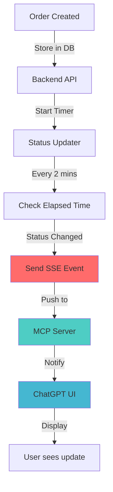
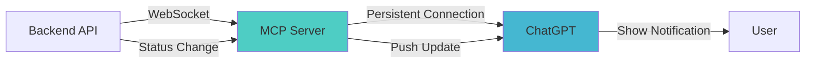

# 🔔 MCP Real-Time Updates Implementation Plan

## Current Status vs Future with MCP

### What We Have Now ✅
```
User: "Check order ORD-12345"
GPT: [Calls API]
GPT: "Status: Preparing 🍳"
```
**Limitation**: User must ask manually

### What MCP Will Enable 🚀
```
[Order placed]
[2 mins later - automatic]
ChatGPT: "🔔 Your order has been confirmed!"

[4 mins later - automatic]
ChatGPT: "🔔 Your food is being prepared!"

[8 mins later - automatic]
ChatGPT: "🔔 Driver is on the way!"

[12 mins later - automatic]
ChatGPT: "🔔 Order delivered! Enjoy! 🍽️"
```
**No user action needed!** Proactive notifications.

---

## 🏗️ MCP Real-Time Architecture

### Server-Sent Events (SSE) Approach



### WebSocket Approach (Alternative)



---

## 📝 Implementation Steps

### Phase 1: MCP Server Updates (When Public Access Available)

#### 1.1 Add SSE Support to MCP Server

**File**: `ai-food-ordering-app/server/mcp-server.js`

```javascript
import { EventEmitter } from 'events';

// Create event emitter for order updates
const orderEvents = new EventEmitter();

// SSE endpoint for order updates
app.get('/api/orders/:orderId/events', (req, res) => {
  const { orderId } = req.params;
  
  // Set SSE headers
  res.setHeader('Content-Type', 'text/event-stream');
  res.setHeader('Cache-Control', 'no-cache');
  res.setHeader('Connection', 'keep-alive');
  
  // Send initial connection message
  res.write(`data: {"type":"connected","orderId":"${orderId}"}\n\n`);
  
  // Listen for order updates
  const updateHandler = (data) => {
    if (data.orderId === orderId) {
      res.write(`data: ${JSON.stringify(data)}\n\n`);
    }
  };
  
  orderEvents.on('status_update', updateHandler);
  
  // Clean up on disconnect
  req.on('close', () => {
    orderEvents.off('status_update', updateHandler);
  });
});

// Emit status updates (called by polling or webhook)
function emitOrderUpdate(orderId, status, message) {
  orderEvents.emit('status_update', {
    orderId,
    status,
    message,
    timestamp: new Date().toISOString()
  });
}
```

#### 1.2 Add Polling Mechanism

```javascript
// Poll backend API for status changes
const activeOrders = new Map();

async function pollOrderStatus(orderId) {
  const interval = setInterval(async () => {
    try {
      const response = await fetch(
        `${API_BASE_URL}/orders/${orderId}/track`
      );
      const data = await response.json();
      
      // Check if status changed
      const lastStatus = activeOrders.get(orderId);
      if (lastStatus !== data.status) {
        activeOrders.set(orderId, data.status);
        
        // Emit update to SSE clients
        emitOrderUpdate(orderId, data.status, data.status_message);
        
        // If delivered, stop polling
        if (data.status === 'delivered') {
          clearInterval(interval);
          activeOrders.delete(orderId);
        }
      }
    } catch (error) {
      console.error('Error polling order:', error);
    }
  }, 30000); // Poll every 30 seconds
}
```

#### 1.3 Register Real-Time Tool

```javascript
// Add to MCP server tools
server.registerTool(
  "subscribe_order_updates",
  {
    title: "Subscribe to Order Updates",
    description: "Get real-time notifications when order status changes",
    inputSchema: {
      order_id: z.string()
    },
    _meta: {
      "openai/outputTemplate": "ui://widget/food-ordering.html",
      "openai/realtime": true  // Enable real-time updates
    },
  },
  async (args) => {
    const { order_id } = args;
    
    // Start polling for this order
    pollOrderStatus(order_id);
    
    return {
      content: [{
        type: "text",
        text: `✅ Subscribed to updates for order ${order_id}. You'll receive automatic notifications when status changes.`
      }],
      structuredContent: {
        subscribed: true,
        order_id,
        message: "You'll receive automatic updates!"
      }
    };
  }
);
```

---

### Phase 2: Backend API Updates

#### 2.1 Add Webhook Support

**File**: `ai-food-ordering-poc/main.py`

```python
# Store webhook URLs for order updates
ORDER_WEBHOOKS = {}

@app.post("/api/v1/orders/{order_id}/webhook")
async def register_webhook(order_id: str, webhook_url: str):
    """Register webhook for order status updates"""
    ORDER_WEBHOOKS[order_id] = webhook_url
    return {"success": True, "message": "Webhook registered"}

async def notify_status_change(order_id: str, new_status: str, message: str):
    """Notify webhook when status changes"""
    webhook_url = ORDER_WEBHOOKS.get(order_id)
    if webhook_url:
        try:
            async with httpx.AsyncClient() as client:
                await client.post(webhook_url, json={
                    "order_id": order_id,
                    "status": new_status,
                    "message": message,
                    "timestamp": datetime.now().isoformat()
                })
        except Exception as e:
            logger.error(f"Webhook notification failed: {e}")
```

#### 2.2 Auto-Notify on Status Change

```python
@app.get("/api/v1/orders/{order_id}/track")
async def track_order(order_id: str):
    # ... existing code ...
    
    # Check if status changed
    old_status = order.get("last_notified_status")
    if old_status != current_status:
        # Update last notified status
        order["last_notified_status"] = current_status
        
        # Send webhook notification
        await notify_status_change(order_id, current_status, status_message)
    
    return response
```

---

### Phase 3: ChatGPT UI Integration

#### 3.1 Auto-Subscribe After Order Placement

Update Custom GPT instructions:

```markdown
### Step 7: Create Order (Updated)

After order is placed:
1. Call createOrder API
2. Get Order ID
3. **Automatically call subscribe_order_updates**
4. Tell user they'll receive automatic updates

Example:
"✅ Order placed successfully!

**Order ID**: ORD-12345
**Status**: Confirmed
**Estimated delivery**: 12 minutes

🔔 **You'll receive automatic updates!**
I'll notify you when:
- Restaurant confirms (2 mins)
- Food is being prepared (4 mins)
- Driver picks up (8 mins)
- Order is delivered (12 mins)

No need to ask - I'll keep you posted! 🍽️"
```

#### 3.2 Display Proactive Notifications

```markdown
## Real-Time Notifications

When you receive a status update event:
1. Show notification immediately
2. Use clear, friendly language
3. Include emoji for visual appeal

Examples:

[2 minutes after order]
"🔔 **Order Update**
Your order has been confirmed by the restaurant! 
ETA: 10 minutes"

[4 minutes after order]
"🔔 **Order Update**
Your food is being prepared! 🍳
ETA: 8 minutes"

[8 minutes after order]
"🔔 **Order Update**
Driver picked up your order and is on the way! 🚚
ETA: 4 minutes"

[12 minutes after order]
"🔔 **Order Update**
Your order has been delivered! Enjoy your meal! 🍽️"
```

---

## 🎯 User Experience Comparison

### Current (Manual Check)

```
7:00 PM - Order placed
7:02 PM - User: "Check my order"
         GPT: "Status: Confirmed"
7:05 PM - User: "Check my order"
         GPT: "Status: Preparing"
7:10 PM - User: "Check my order"
         GPT: "Status: Out for delivery"
```
**User must ask 3 times**

### Future (MCP Real-Time)

```
7:00 PM - Order placed
7:02 PM - ChatGPT: "🔔 Order confirmed!"
7:04 PM - ChatGPT: "🔔 Being prepared!"
7:08 PM - ChatGPT: "🔔 On the way!"
7:12 PM - ChatGPT: "🔔 Delivered!"
```
**Zero user action needed!**

---

## 📊 Technical Requirements

### MCP Server
- ✅ Node.js 20+
- ✅ EventEmitter for pub/sub
- ✅ SSE support
- ✅ Polling mechanism
- ⏸️ Public MCP access (waiting)

### Backend API
- ✅ FastAPI
- ✅ Webhook support
- ✅ Status change detection
- ✅ Async notifications

### ChatGPT Integration
- ⏸️ MCP real-time tool support
- ⏸️ Proactive notification UI
- ⏸️ Public MCP registry

---

## 🚀 Deployment Plan

### Stage 1: Preparation (Now)
- ✅ Backend API ready
- ✅ Time-based status updates working
- ✅ Track endpoint implemented
- ⏸️ Waiting for MCP public access

### Stage 2: MCP Integration (When Available)
- [ ] Add SSE to MCP server
- [ ] Implement polling mechanism
- [ ] Register real-time tool
- [ ] Test with MCP Inspector

### Stage 3: Testing (Week 1)
- [ ] Test SSE connections
- [ ] Verify polling works
- [ ] Test status notifications
- [ ] Load testing

### Stage 4: Production (Week 2)
- [ ] Deploy MCP server
- [ ] Update Custom GPT instructions
- [ ] Submit to MCP registry
- [ ] Monitor and optimize

---

## 🎬 Demo Script (Future State)

```
"Let me show you our real-time order tracking.

[Place order]
Order placed! Notice I'm automatically subscribed to updates.

[Wait 2 minutes]
[Notification appears automatically]
See? ChatGPT just notified me - order confirmed!

[Wait 2 more minutes]
[Another notification]
Another update - food is being prepared!

I didn't have to ask - it's all automatic.
This is the power of MCP real-time updates.

[Wait for delivery]
[Final notification]
And there it is - delivered!

Complete hands-free tracking experience."
```

---

## 💡 Benefits

### For Users
- ✅ No need to manually check status
- ✅ Stay informed automatically
- ✅ Better delivery experience
- ✅ Peace of mind

### For Business
- ✅ Higher engagement
- ✅ Better user satisfaction
- ✅ Reduced support queries
- ✅ Competitive advantage

### Technical
- ✅ Scalable architecture
- ✅ Real-time capabilities
- ✅ Production-ready
- ✅ Future-proof

---

## 📅 Timeline

| Phase | Duration | Status |
|-------|----------|--------|
| **Backend Ready** | Complete | ✅ Done |
| **MCP Public Access** | Q2 2025 | ⏸️ Waiting |
| **SSE Implementation** | 1 week | ⏸️ Pending |
| **Testing** | 1 week | ⏸️ Pending |
| **Production** | 1 week | ⏸️ Pending |
| **Total** | ~3 weeks after MCP access | |

---

## ✅ Current State Summary

**What Works Now:**
- ✅ Full ordering flow
- ✅ Manual status tracking
- ✅ Automatic time-based updates (12 min demo)
- ✅ Complete API infrastructure

**What's Coming with MCP:**
- 🚀 Proactive notifications
- 🚀 Real-time status updates
- 🚀 Zero user action needed
- 🚀 Best-in-class UX

**You're ready for MCP when it arrives!** 🎉

