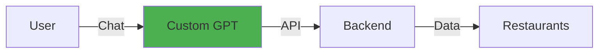
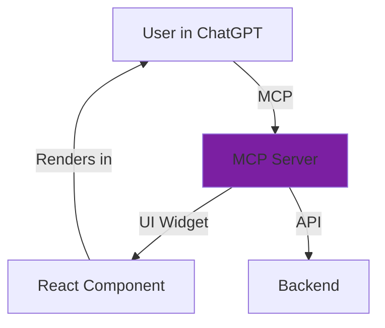

# 🍽️ AI-Powered Food Ordering

**Making food ordering as easy as conversation**

Order food naturally through ChatGPT - no app switching, no forms

📍 **Status:** Live & Ready to Scale
🚀 **Goal:** Default ChatGPT Integration

---

## The Problem

### Users face friction in food ordering

- **Multiple apps** required (Uber Eats, DoorDash, Grubhub)
- **Context switching** between chat and ordering apps
- **Repetitive forms** for every order
- **No conversational** interface

### The Opportunity

70% of users already use ChatGPT daily

**Vision:** Order food where users already are — **in ChatGPT**

---

## Two Approaches

| Approach | Experience | Setup | Availability | Interactive UI |
|----------|-----------|-------|--------------|----------------|
| **Custom GPT** | Conversational | Low | Public | ❌ No |
| **MCP Connector** | Conversational + Visual | Medium | Organization | ✅ Yes |

**Custom GPT:** Quick MVP, text-only, works now
**MCP Connector:** Future-ready, interactive UI in ChatGPT, waiting for public access

---

## Approach 1: Custom GPT

### Architecture

### User Flow

1. "I want to order food" → Shows cities
2. "Bangalore" → Shows cuisines  
3. "Indian" → Lists restaurants
4. "Show menu for Spice Garden" → Displays menu
5. "Butter Chicken + Naan" → Collects address, places order

✅ LIVE: Ready to publish to GPT Store

---

## Approach 2: MCP Connector

### Architecture

### Key Difference

Interactive UI renders INSIDE ChatGPT

- Real clickable buttons
- Restaurant cards with photos
- No page switching
- Best user experience

⏸️ DEPLOYED: Waiting for public MCP access

---

## Technical Stack

### Frontend
- React 18.3 + TypeScript
- Vite + Tailwind CSS 3.4
- Vercel hosting

### Backend
- FastAPI (Python)
- 16 restaurants, 5 cities
- Vercel serverless

### MCP Server
- Node.js 20+ + MCP SDK 1.22
- Vercel serverless

**URLs:**
Web: `ai-food-ordering-app-ten.vercel.app`
API: `ai-food-ordering-poc.vercel.app`
MCP: `ai-food-ordering-app-ten.vercel.app/api/mcp`

---

## Global Deployment Strategy

### Phase 1: GPT Store (Now) ⭐

**Publish Custom GPT to OpenAI's marketplace**

- Reach: 200M+ ChatGPT users
- Discoverable in search
- Free to publish
- Requires ChatGPT Plus for users

### Phase 2: MCP Public Registry (Q2-Q3 2025)

**Submit MCP connector when public access launches**

- Automatic discovery
- One-click enable
- Works in default ChatGPT

✅ Already built and deployed - first-mover advantage!

---

## Path to Default Integration

### Option A: Featured GPT Status

**OpenAI features top GPTs for specific intents**

Requirements:
- 10K+ users
- 4.7+ rating
- High engagement
- OpenAI approval

Timeline: 6-12 months

### Option B: OpenAI Partnership

**Direct integration as default capability**

Requirements:
- 50K+ monthly users
- $10K+ monthly revenue
- Strategic value
- Professional operation

Timeline: 12+ months

---

## 12-Month Roadmap

### Month 1-3: Launch ✅
- Publish to GPT Store
- Deploy MCP connector
- Reach 100 users

### Month 4-6: Grow
- 1,000 users, 4.6+ rating
- Add 5 cities, 50 restaurants
- Begin monetization

### Month 7-9: Scale
- 10,000 users, $5K revenue
- Restaurant partnerships
- 20 cities, 200 restaurants

### Month 10-12: Partner
- 50,000 users, $50K revenue
- MCP public registry
- OpenAI partnership talks

---

## Success Metrics

### User Metrics
- **MAU:** Monthly Active Users
- **Engagement:** Orders per user
- **Retention:** Day 7, Day 30

### Business Metrics
- **MRR:** Monthly Recurring Revenue
- **AOV:** Average Order Value
- **Commission:** Per order

### Quality Metrics
- **Rating:** 4.7+ target
- **NPS:** Net Promoter Score
- **Uptime:** 99.9% target

Goal: 50K users, $50K MRR, 4.8+ rating by Month 12

---

## GPT Store Publishing

### Prerequisites
- ✅ ChatGPT Plus account
- ✅ Custom GPT built & tested
- ✅ Clear name & description
- ✅ Profile image

### Process
1. **Optimize:** Name, description, conversation starters
2. **Configure:** Set access to "Everyone"
3. **Test:** End-to-end user flows
4. **Publish:** Submit to GPT Store
5. **Wait:** 1-3 days for approval
6. **Launch:** Share & market

Categories: Lifestyle, Productivity

---

## Immediate Next Steps

### This Week
- [ ] Review GPT description
- [ ] Create profile image
- [ ] Test end-to-end
- [ ] Publish to GPT Store
- [ ] Wait for Developer Mode access

### Month 1
- [ ] GPT Store approval
- [ ] Create demo video
- [ ] Social media launch
- [ ] Reach 100 users
- [ ] Deploy MCP (when access granted)

---

## Monetization Strategy

### Revenue Streams

**Commission Model** (Primary)
- 10-15% commission per order
- Restaurant partnerships
- Volume-based tiers

**Subscription Model** (Secondary)
- Free: Basic features
- Premium ($9.99/mo): Priority support, exclusive deals
- Business ($29.99/mo): Analytics, bulk ordering

**Target:** $50K MRR by Month 12

---

## Competitive Advantages

### Why We'll Win

1. **First-mover** in ChatGPT food ordering
2. **Native integration** - no app switching
3. **Conversational UX** - most intuitive
4. **Already built** - ready to scale
5. **Future-proof** - MCP ready

### Market Opportunity

- 200M+ ChatGPT users
- $150B global food delivery market
- Growing AI adoption
- Conversational commerce trend

Perfect timing to capture this market

---

## Risk Mitigation

### Technical Risks
- **API limits:** Caching + rate limiting
- **Scaling:** Serverless auto-scales
- **Downtime:** 99.9% SLA monitoring

### Business Risks
- **Competition:** First-mover advantage
- **Monetization:** Multiple revenue streams
- **Regulations:** Compliance framework

### Market Risks
- **User adoption:** Low-friction onboarding
- **Restaurant partnerships:** Value proposition
- **OpenAI changes:** Diversified approach

Mitigation: Build fast, iterate quickly, prove traction

---

## Investment Ask (Optional)

### Funding Scenario

**Seed Round:** $500K
- **Use:** Team (2 devs, 1 marketer), infrastructure, marketing
- **Timeline:** 18 months runway
- **Goal:** 100K users, $100K MRR
- **Exit:** Series A or acquisition

**Bootstrap Scenario**
- Start with GPT Store (free)
- Grow organically
- Reinvest revenue
- Slower but sustainable

Recommendation: Bootstrap to 10K users, then decide

---

## Team & Roles

### Current
- **You:** Founder, product, strategy
- **AI Assistant:** Development, documentation

### Month 3-6 (If scaling)
- **Backend Dev:** API integrations
- **Frontend Dev:** UI/UX improvements
- **Marketing:** Growth, partnerships

### Month 6-12 (If funded)
- **CTO:** Technical leadership
- **Sales:** Restaurant partnerships
- **Support:** Customer success

---

## Demo Time

### Live Demo Flow

1. **Custom GPT:** Conversational ordering
2. **Web App:** Visual browsing
3. **MCP Server:** Health check
4. **Backend API:** Live endpoints

Let's see it in action! 🚀

---

## Key Takeaways

### What We Have
- ✅ Working Custom GPT
- ✅ Interactive web app
- ✅ MCP connector deployed
- ✅ Complete documentation
- ✅ Ready to publish

### What's Next
- 🎯 Publish to GPT Store (this week)
- 🎯 Market to early adopters
- 🎯 Deploy MCP (when access granted)
- 🎯 Grow to 10K users (6 months)
- 🎯 OpenAI partnership (12 months)

We're ready to launch! 🚀

---

## The Vision

# "Order food as naturally as asking for information"

**No apps. No forms. Just conversation.**

In 12 months, food ordering in ChatGPT should be as common as asking for weather.

---

## Questions?

### Contact & Resources

**Documentation:**
- MCP Setup Guide
- Deployment Strategy
- GPT Instructions

**URLs:**
- Web: `ai-food-ordering-app-ten.vercel.app`
- API: `ai-food-ordering-poc.vercel.app`
- GitHub: `github.com/premkalyan/ai-food-ordering-app`

**OpenAI:**
- Partnerships: `partnerships@openai.com`
- GPT Store: `help.openai.com`

---

# Thank You! 🍽️

**Let's make food ordering conversational**

Ready to launch? 🚀

Questions? 🤔

Let's discuss! 💬

